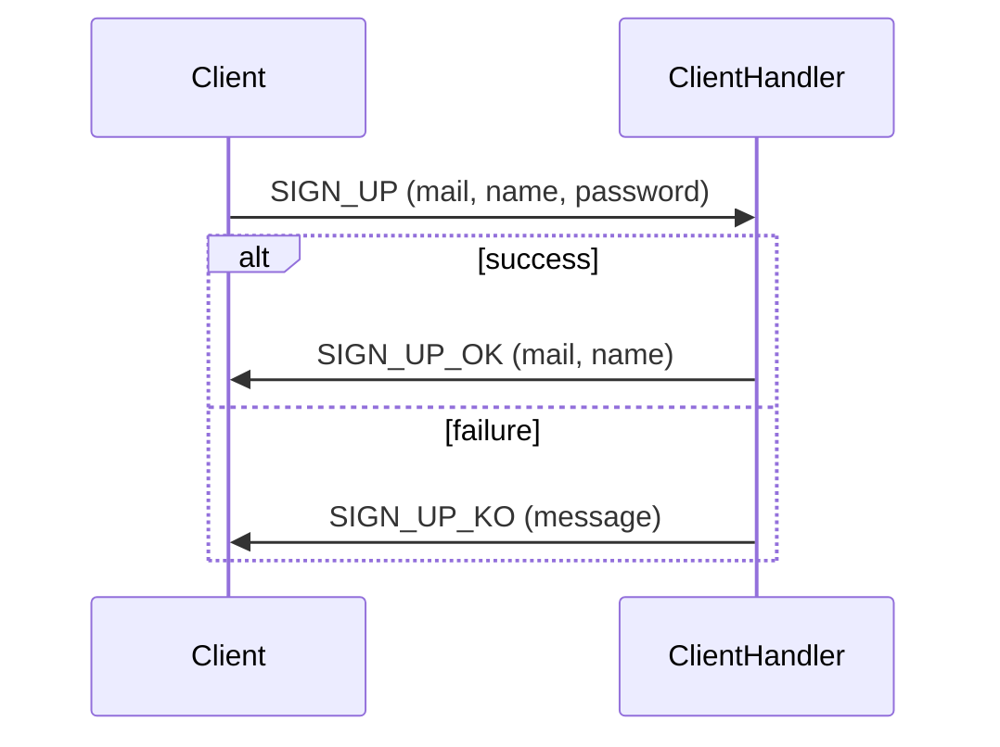
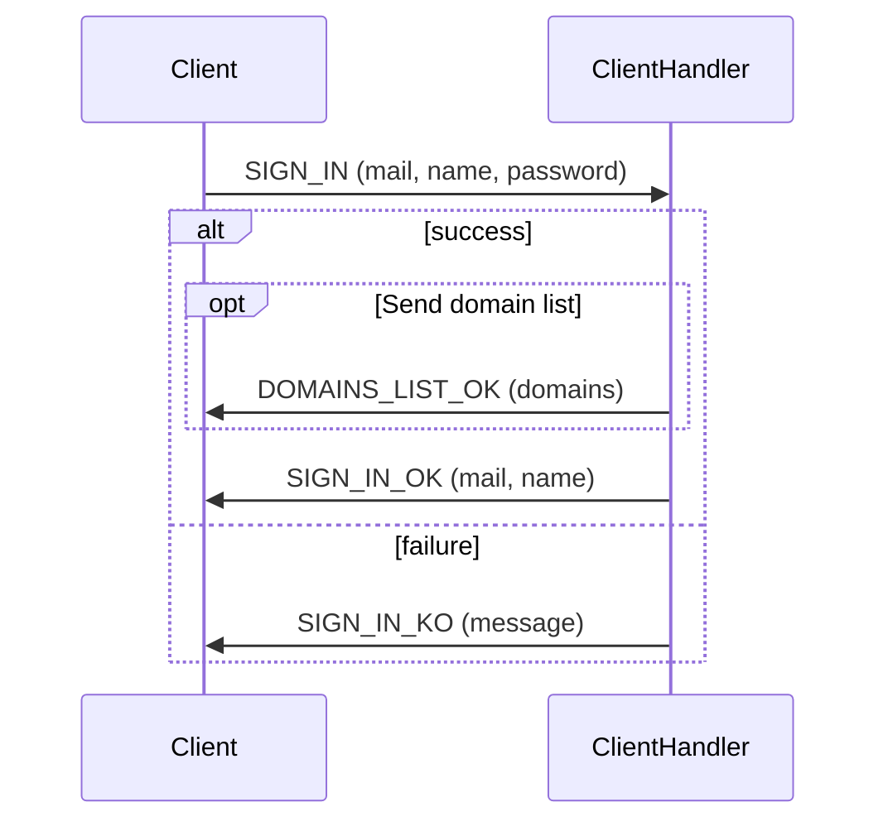
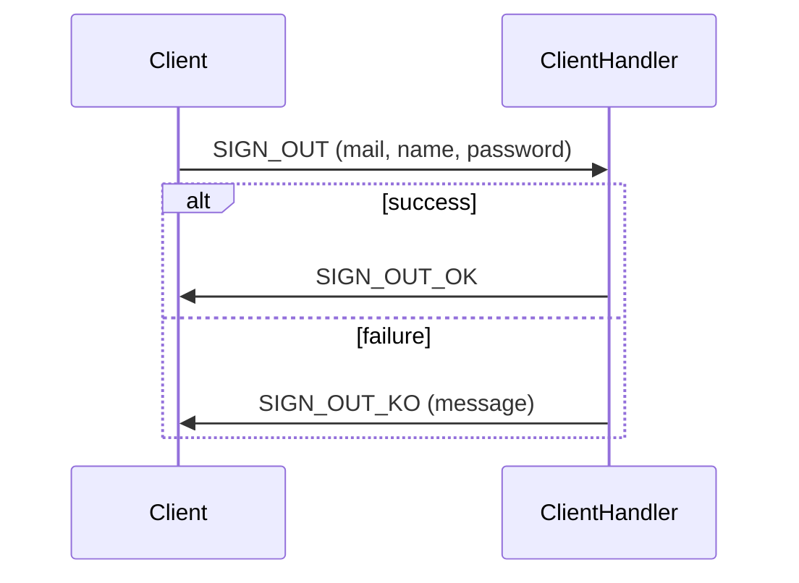

# RFC

## 1. Introduction

This document specifies the protocol used in the project BazAds.

## 2. Request from clients to the central server server

### 2.1 Get the public key of the central server

All exchanges between a client and the central server are encrypted. To that end, both the client and server has a public and private key pair. After exchanging public keys and performing key agreement, a shared secret is derived and used to encrypt all subsequent communications.

#### Request

`REQUEST_PUBLIC_KEY_OF_CENTRAL_SERVER (client's public key)`

| Variable                  | Type         |
| :-----------------------: | :----------: |
| Client's public key       | PublicKey    |

#### Expected responses

[REQUEST_PUBLIC_KEY_OF_CENTRAL_SERVER_OK](#get_server_public_key_success)

[REQUEST_PUBLIC_KEY_OF_CENTRAL_SERVER_KO](#get_server_public_key_failure)

#### Sequence diagram

@mermaid{request_public_key_of_central_server}

### 2.2 Sign up

A client has to send its mail, name and password to sign up.

`SIGN_UP (mail, name, password)`

| Variable   | Type      |
| :--------: | :-------: |
| mail       | String    |
| name       | String    |
| password   | String    |

Expected responses (clickable links): [`SIGN_UP_OK`](#321-successful-sign-up-request) or [`SIGN_UP_KO`](#322-failed-sign-up-request).

### 2.3 Request for sign in

A client has to send its mail and password to sign in. In addition, there is a boolean value to determine if, in case of successful sign in, the server send automatically the list of the dommain sales.

`SIGN_IN (mail, password, sendDomainList)`

| Variable         | Type       |
| :--------------: | :--------: |
| mail             | String     |
| password         | String     |
| sendDomainList   | Boolean    |

Expected responses (clickable links): [`SIGN_IN_OK`](#331-successful-sign-in-request) or [`SIGN_IN_KO`](#332-failed-sign-in-request).

### 2.4 Request for sign out

A client just have to notify the server that he logs out. No additional parameters are needed.

`SIGN_OUT`

Expected responses (clickable links): [`SIGN_OUT_OK`](#341-successful-sign-out-request) or [`SIGN_OUT_KO`](#342-failed-sign-out-request).

### 2.5 Request for create a sale

A client has to send the domain, the name, the content and the price for the new sale.

`CREATE_SALE (domain, title, content, price)`

| Variable         | Type       |
| :--------------: | :--------: |
| domain           | String     |
| title            | String     |
| content          | String     |
| price            | int        |

Expected responses: [`CREATE_SALE_OK`](#351-successful-create-a-sale-request) or [`CREATE_SALE_KO`](#352-failed-create-a-sale-request).

### 2.6 Request for update a sale

A client has to send the new title, the new content, the new price of the sale and the id of the sale being updated. The domain can't be changed.

`UPDATE_SALE (title, content, price, id)`

| Variable         | Type       |
| :--------------: | :--------: |
| title            | String     |
| content          | String     |
| price            | int        |
| id               | int        |

Expected responses: [`UPDATE_SALE_OK`](#361-successful-update-a-sale-request) or [`UPDATE_SALE_KO`](#362-failed-update-a-sale-request).

### 2.7 Request for delete a sale

A client has to send the id of the sale he wants to delete. A client can delete a sale only if he's its owner.

`REMOVE_SALE (id)`

| Variable         | Type       |
| :--------------: | :--------: |
| id               | int        |

Expected responses: [`REMOVE_SALE_OK`](#371-successful-delete-a-sale-request) or [`REMOVE_SALE_KO`](#372-failed-delete-a-sale-request).

### 2.8 Request for the list of domain sales

A client just have to notify the server to the server that he wants the list of the domains. 

`DOMAINS_LIST`

Expected responses: [`DOMAINS_LIST_OK`](#381-successful-list-of-domain-sales-request) or [`DOMAINS_LIST_KO`](#382-failed-list-of-domain-sales-request).

### 2.9 Request for the sales on a specific domain

A client has to send the domains from which he wants to retrieve the sales.

`SALES_FROM_DOMAIN (domain)`

| Variable         | Type       |
| :--------------: | :--------: |
| domain           | Domain     |

Expected responses: [`SALE_FROM_DOMAIN_OK`](#391-successful-list-of-sales-on-a-specific-domain-request) or [`SALE_FROM_DOMAIN_KO`](#392-failed-list-of-sales-on-a-specific-domain-request).

/**
 * @mermaid{sales_from_domain}
 */

## 3. Request from the server to the client

### 3.1 Get the public key of the central server

### 3.1.1 Success {#get_server_public_key_success}

The server send the public key to the client.

`REQUEST_PUBLIC_KEY_OF_CENTRAL_SERVER_OK (server's public key)`

| Variable            | Type       |
| :-----------------: | :--------: |
| Server's public key | PublicKey  |

Answer to request [`REQUEST_PUBLIC_KEY_OF_CENTRAL_SERVER`](#21-request-the-public-key-of-the-server) (clickable link).

### 3.1.2 Failure {#get_server_public_key_failure}

The server send an error message to the client.

Reason of failure:
- the server process the incoming request but don't answer to them.

`REQUEST_PUBLIC_KEY_OF_CENTRAL_SERVER_KO (message)`

| Variable    | Type       |
| :---------: | :--------: |
| Message     | String     |

Answer to request [`REQUEST_PUBLIC_KEY_OF_CENTRAL_SERVER`](#21-request-the-public-key-of-the-server) (clickable link).

### 3.2 Sign up requested

### 3.2.1 Successful sign up request

The server send the confirmation of sign up with the mail and the name of the client.

`SIGN_UP_OK(mail, name)`

| Variable    | Type       |
| :---------: | :--------: |
| Mail        | String     |
| Name        | String     |

Answer to request [`SIGN_UP`](#22-request-for-sign-up) (clickable link).

### 3.2.2 Failed sign up request

The server send an error message to the client.

Reason of failure:
- the server process the incoming request but don't answer to them;
- the mail is not a valid format;
- the mail is already taken;
- the name is not valid.

`SIGN_UP_KO (message)`

| Variable    | Type       |
| :---------: | :--------: |
| Message     | String     |

Answer to request [`SIGN_UP`](#22-request-for-sign-up) (clickable link).

## 3.3 Sign in requested

### 3.3.1 Successful sign in request

The server send the confirmation of sign in with the name of the client.

`SIGN_IN_OK (name)`

| Variable    | Type       |
| :---------: | :--------: |
| Name        | String     |

Answer to request [`SIGN_IN`](#23-request-for-sign-in) (clickable link).

### 3.3.2 Failed sign in request

The server send an error message to the client.

Reason of failure:
- the server process the incoming request but don't answer to them;
- the mail is not registered;
- the mail password is invalid.

`SIGN_IN_KO (message)`

| Variable    | Type       |
| :---------: | :--------: |
| Message     | String     |

Answer to request [`SIGN_IN`](#23-request-for-sign-in) (clickable link).

### 3.4 Sign out requested

### 3.4.1 Successful sign out request

The server send the confirmation of sign out.

`SIGN_OUT_OK`

Answer to request [`SIGN_OUT`](#24-request-for-sign-out) (clickable link).

### 3.4.2 Failed sign out request

The server send an error message to the client.

Reason of failure:
- the server process the incoming request but don't answer to them.

`SIGN_OUT_KO (message)`

| Variable    | Type       |
| :---------: | :--------: |
| Message     | String     |

Answer to request [`SIGN_OUT`](#24-request-for-sign-out) (clickable link).

## 3.5 Create a sale request

### 3.5.1 Successful create a sale request

The server send the confirmation of the creation of the sale with the title of the sale.

`CREATE_SALE_OK (title)`

| Variable    | Type       |
| :---------: | :--------: |
| Title       | String     |

Answer to request [`CREATE_SALE`](#25-request-for-create-a-sale) (clickable link).

### 3.5.2 Failed create a sale request

The server send an error message to the client.

Reason of failure:
- the server process the incoming request but don't answer to them.

`CREATE_SALE_KO (message)`

| Variable    | Type       |
| :---------: | :--------: |
| Message     | String     |

Answer to request [`CREATE_SALE`](#25-request-for-create-a-sale) (clickable link).

## 3.6 Update a sale request

### 3.6.1 Successful update a sale request

The server send the confirmation of the update of the sale.

`UPDATE_SALE_OK`

Answer to request [`UPDATE_SALE`](#26-request-for-update-a-sale) (clickable link).

### 3.6.2 Failed update a sale request

The server send an error message to the client.

Reason of failure:
- the server process the incoming request but don't answer to them.

`UPDATE_SALE_KO (message)`

| Variable    | Type       |
| :---------: | :--------: |
| Message     | String     |

Answer to request [`UPDATE_SALE`](#26-request-for-update-a-sale) (clickable link).

## 3.7 Delete a sale request

### 3.7.1 Successful delete a sale request

The server send the confirmation of the deletion of the sale.

`REMOVE_SALE_OK`

Answer to request [`REMOVE_SALE`](#27-request-for-delete-a-sale) (clickable link).

### 3.7.2 Failed delete a sale request

The server send an error message to the client.

Reason of failure:
- the server process the incoming request but don't answer to them.

`REMOVE_SALE_KO (message)`

| Variable    | Type       |
| :---------: | :--------: |
| Message     | String     |

Answer to request [`REMOVE_SALE`](#27-request-for-delete-a-sale) (clickable link).

## 3.8 List of domain sales request

### 3.8.1 Successful list of domain sales request

The server send the list of the domains.

`DOMAIN_LIST_OK (domains)`

| Variable    | Type       |
| :---------: | :--------: |
| domains     | Domains[]  |

Answer to request [`DOMAINS_LIST`](#28-request-for-the-list-of-domain-sales) (clickable link).

### 3.8.2 Failed list of domain sales request

The server send an error message to the client.

Reason of failure:
- the server process the incoming request but don't answer to them.

`DOMAIN_LIST_KO (message)`

| Variable    | Type       |
| :---------: | :--------: |
| Message     | String     |

Answer to request [`DOMAINS_LIST`](#28-request-for-the-list-of-domain-sales) (clickable link).

## 3.9 List of sales on a specific domain request

### 3.9.1 Successful list of sales on a specific domain request

The server send the list of the sales on the specific domain.

`SALE_FROM_DOMAIN_OK (sales)`

| Variable    | Type         |
| :---------: | :----------: |
| sales       | Annonce[]    |

Answer to request [`SALE_FROM_DOMAIN`](#29-request-for-the-sales-on-a-specific-domain) (clickable link).

### 3.9.2 Failed list of sales on a specific domain request

The server send an error message to the client.

Reason of failure:
- the server process the incoming request but don't answer to them.

`SALE_FROM_DOMAIN_KO (message)`

| Variable    | Type       |
| :---------: | :--------: |
| Message     | String     |

Answer to request [`SALE_FROM_DOMAIN`](#29-request-for-the-sales-on-a-specific-domain) (clickable link).

## 4. Serialization of the requests

The following diagram shows the serialization of a request. It holds zhen the request is encrypted, that is everytime except for the request `REQUEST_PUBLIC_KEY_OF_CENTRAL_SERVER` and their associated responses `REQUEST_PUBLIC_KEY_OF_CENTRAL_SERVER_OK` and `REQUEST_PUBLIC_KEY_OF_CENTRAL_SERVER_KO`.

